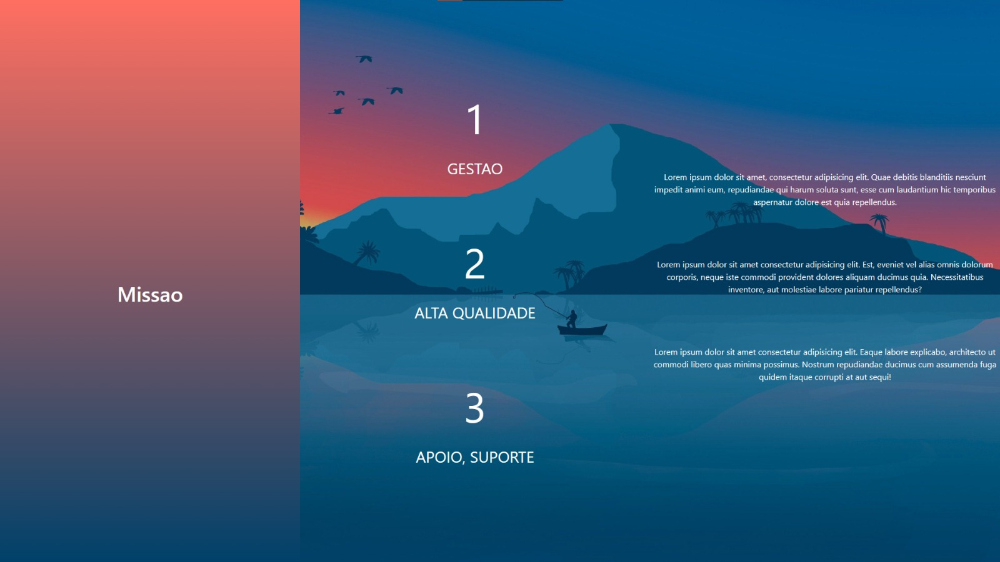
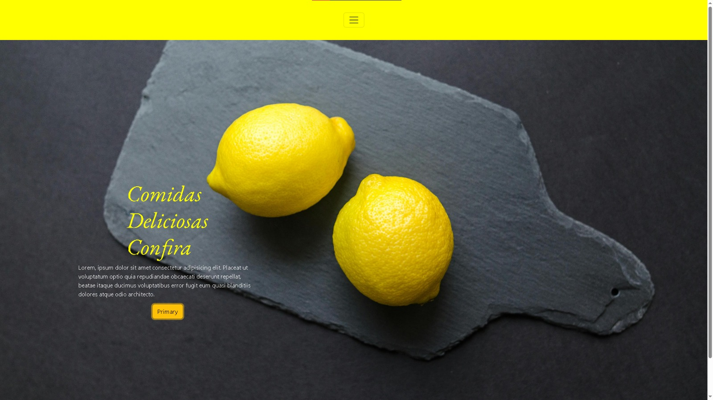
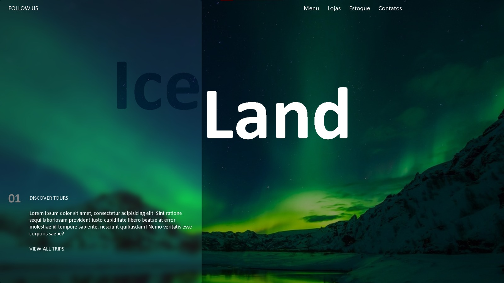

 # Galeria de Projetos

Bem-vindo à Galeria de Projetos! Este repositório é um espaço onde você pode encontrar uma coleção de projetos que desenvolvemos. Cada pasta neste repositório representa um projeto individual, com seu código-fonte, imagens e uma pequena descrição.

## Projetos Disponíveis

- [Projeto 01](https://65ff3fd7430d3e4806cca21b--taupe-quokka-c9e388.netlify.app/): Site simples feito com base em um modelo encontrado na internet.
 

- [Projeto 02](https://65ff3ff7eb20374beb1fad0c--taupe-quokka-c9e388.netlify.app/): Site simples feito com base em um modelo encontrado na internet.
 

 - [Projeto 03](https://65ff40018007764d077c6c41--taupe-quokka-c9e388.netlify.app/): IceLand.
 
